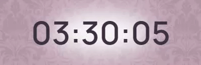
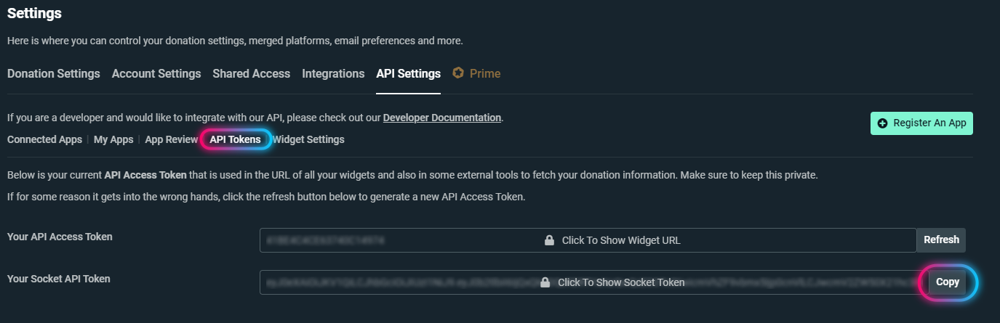
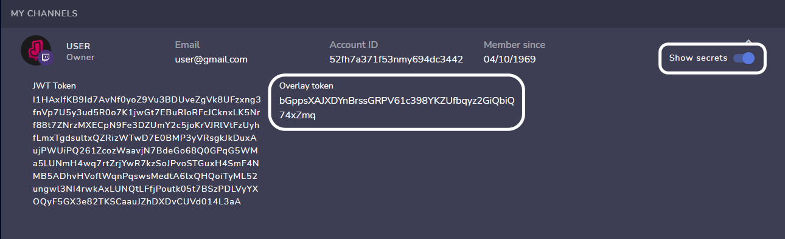
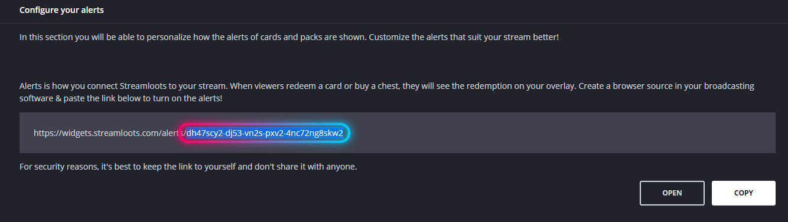

<h1 align="center">Twitch Subathon Countdown Template</h1>

This is the template I created for my Twitch Subathon Countdowns

 

<h2>Description</h2>

A subathon timer that increases when someone subscribes, donates money, donates bits or purchases streamloots chests.

 

<h2>Preview</h2>
<h3 align="center"></h3>
 

<h2>Usage</h2>

After cloning this repository you'll have to edit the "config.js" file with any plain text editor, then change the value of the variables acording to what you want:

<h3>Streamlabs Token</h3>

To get the token you'll have to go to the api settings tab of your <a href="https://streamlabs.com/dashboard#/settings/api-settings">Streamlabs dashboard</a> then click on API Tokens, copy your socket API token and finally paste the code on the "streamlabs_token" variable in the "config.js" file.

<h3>StreamElements Token</h3>

To get the token you'll have to go to your <a href="https://streamelements.com/dashboard/account/channels">StreamElements channels dashboard</a>, then click on show secrets, copy the Overlay token and paste the code on the "streamelements_token" variable in the "config.js" file.

<h3>Streamloots Token</h3>

To get the token you'll have to go to your Streamloots creator dashboard, then to alerts & widgets, then go to alerts, then copy the last part of the alerts url and finally paste the code on the "streamloots_token" variable in the "config.js" file.

<h3>Initial Time</h3>

You can set the initial time of the timer by setting the hours, minutes and seconds to be added when the timer is created.

<h3>Other Values</h3>

Change the other values to set the amount of seconds that will be added for the suscriptions, donations... And the minimum donation amounts to trigger the countdown increase.

<h3>Add To OBS</h3>

To add it to OBS you just have to drag the "index.html" file to the sources section or add a browser source that points to the "index.html" file.

